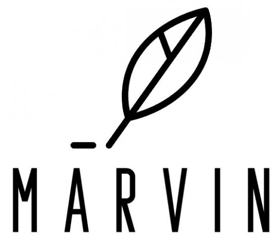

# marvin
[Marvin](https://en.wikipedia.org/wiki/Marvin_the_Paranoid_Android) is a style translator. It's the next generation of writing aids. We're building Marvin for all the hitchhikers, out there in the galaxy. Don't panic! 

This is part of the MIMS capstone project by Daniel, Priyam and Vivek, advised by Marti Hearst and Dongyeop Kang. 

---
## Resources
- [Proposal Write-up](./resources/Capstone_Proposal.pdf)
- [Proposal Presentation](https://docs.google.com/presentation/d/1WDxKhQlrkEXCB8D0i7ft0GGVZ21YWNWPEra_PcqXI2o/edit?usp=sharing)
- [Mid Semester Report](./resources/Mid_Semester_Report.pdf)
- [Final Report](./resources/Final_Report.pdf)

## What is Marvin?
We have created an AI powered tool for stylistic language editing called Marvin. Marvin leverages a combination of recent Natural Language Processing (NLP) and deep learning innovations in text classification and generation as well as visualization and interpretation techniques. Marvin provides the ability to classify the style of texts, transfer to other styles as well as understand how certain features contribute to style. It strives to adhere to a machine-in-the-loop framework, where writing is performed largely by human users, but is aided by algorithmic suggestions. 

We evaluated the machine learning models that comprise Marvin on several benchmark metrics and determined that these models are able to perform well on linguistic style tasks. One of Marvin’s primary novel contributions is the ability to transfer to different specific levels of a particular style. It also can perform joint style analysis and transfer for several dimensions of style simultaneously. 

At the School of Information we find ourselves at the intersection of cutting edge research and a will to democratize access to such research. Throughout history, the written word has played a vital role in expanding the horizons of human consciousness. And effective use of stylistic language is ubiquitous in this pursuit, from scientific text and Wikipedia to the writings of Shakespeare and Mahatma Gandhi. Unfortunately, language famously suffers from issues of bias, accessibility and quality control. Anyone who has ever made a Wikipedia edit or has written a technical blog post immediately recollects the dozens of examples one has to pore over, to emulate the style, objectivity and tenor of the writing style. Adherence to a particular style can often be used as a proxy measure of value. At best, this leads to a high variance in quality, and at worst, it makes the process of writing entirely prohibitive to newcomers. We believe that a system, such as Marvin, will help users generate style-conformant content and can democratize access to domains for fledgling writers from various backgrounds.

## Features
- Classification of text along different style axes
    - Including macro-styles like domains and micro-styles like emotions
- Transfer of text from one style to another
    - Eg: Modern English →Shakespearean
- Transfer of text from one point of a style spectrum to another
    - Eg: Mid Formality → High Formality
- Transfer of text to a combination of multiple styles
    - Eg: Low Formality and Happy →  High Formality and Sad
- Visualization of feature importance for styles
    - Understand how each word contributes to scores

## Project Deliverables

- Datasets Created:
    - Macro-style datasets (Wikipedia and scientific abstracts)
    - Pseudo-parallel datasets for performing style transfer
    - Cross-labelled style datasets for joint style analysis
- Machine Learning Models Created:
    - Joint style classifiers
    - Style-stripping paraphraser
    - Style transfer models
    - Input attribution methods for interpretation
- Application Built:
    - UI for writing, displaying style statistics, and generating suggestions
    - Containerized ML server and App server
    - Database for storing results
    - APIs to interface between components

## Running the Application
Marvin has two applications (WebApp, ML service). Instructions to run them are in the respective directories' `README` files.